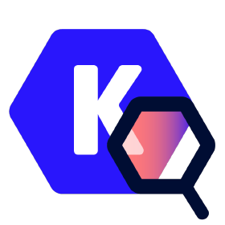

  <a href="https://www.awsweb.online" style="text-decoration: none; display: inline-block;">
    <h1 style="display: inline;">Bridging Cloud and DevOps</h1>
  </a>

  

 Unlocking the Potential of Cloud Technologies and DevOps Tools: Explore Comprehensive Learning Content for Enhanced Expertise 

## Amazon WebServices

- [Amazon WebServices WorkShop](aws/README.md)

 

## Kubernetes

 

- [Notes + Learning Resources](Kubernetes/README.md)
- [Commands](Kubernetes/commands/README.md)
- [Manifest Files](https://github.com/awsautomation/CloudOps/tree/main/Kubernetes/YAML)

 

## Docker

 

- [Notes + Learning Resources](Docker/README.md)
- [Commands](Docker/commands/README.md)
- [Compose/Stack Files](https://github.com/awsautomation/CloudOps/tree/main/Docker/YAML)
- [Dockerfile](https://github.com/awsautomation/CloudOps/tree/main/Docker/Dockerfile)

 

## GitHub Actions

 

- [Notes + Learning Resources](GitHub-Actions/README.md)
- [Workflows](https://github.com/awsautomation/CloudOps/tree/main/GitHub-Actions/Workflows)

 

## Linux

 

- [Notes + Learning Resources](Linux/README.md)
- [Commands](Linux/commands/README.md)

 

## Git 

 

- [Notes + Learning Resources](Git/README.md)
- [Commands](Git/commands/README.md)

 

## Networking

 

- [Notes + Learning Resources](Networking/README.md)
- [Commands](Networking/commands/README.md)

 

## YAML

 

- [Notes + Learning Resources](YAML/README.md)
- [Syntax](YAML/syntax/README.md)

 

## Go

 

- [Notes + Learning Resources](Go/README.md)
- [Concepts](https://github.com/awsautomation/CloudOps/tree/main/Go/Concepts)
- [Practice App](https://github.com/awsautomation/CloudOps/tree/main/Go/App)

 

## Helm

 

- [Notes + Learning Resources](Helm/README.md)

 

## Prometheus

 

- [Notes + Learning Resources](Prometheus/README.md)

 

## GitOps

 

- [Notes + Learning Resources](GitOps/README.md)

 

## ArgoCD

 

- [Notes + Learning Resources](ArgoCD/README.md)
- [Manifest Files](https://github.com/awsautomation/CloudOps/tree/main/ArgoCD/YAML)

 

## Portainer

 

- [Notes + Learning Resources](Portainer/README.md)

 

## Jenkins 

 

- [Notes + Learning Resources](Jenkins/README.md)
- [Jenkinsfile](https://github.com/awsautomation/CloudOps/tree/main/Jenkins/Jenkinsfile)

 

## Bash Scripting 

 

- [Notes + Learning Resources](Bash-Scripting/README.md)
- [Script](https://github.com/awsautomation/CloudOps/tree/main/Bash-Scripting/Scripts)

 

## Lens IDE

 

- [Notes + Learning Resources](Lens/README.md)

 

## Kubescape 

 

- [Notes + Learning Resources](Kubescape/README.md)

 

## ValidKube 

 

- [Notes + Learning Resources](Validkube/README.md)

 

<!-- ### Topic to cover
- Ansible
- Terraform
- CI/CD
- Advanced Networking
 -->
